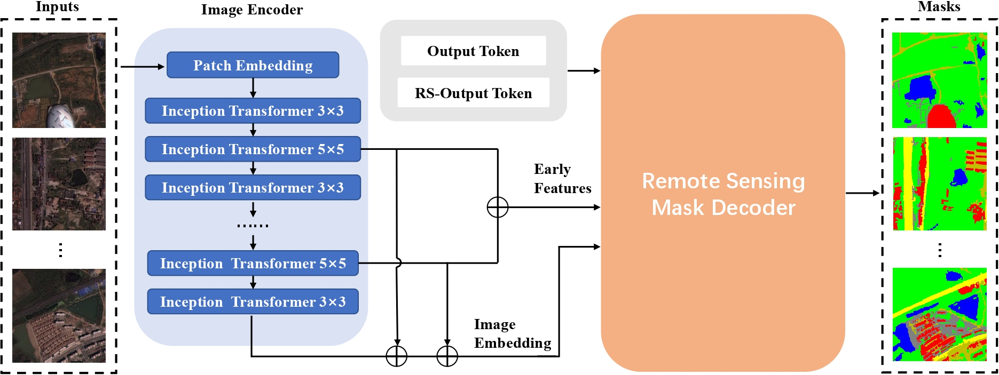

# MeSAM
This repository contains the implementation of the following paper:
> **MeSAM: Multiscale Enhanced Segment Anything Model for Optical Remote Sensing Images**

## Overview

Segment anything model (SAM) has been widely applied to various downstream tasks for its excellent performance and generalization capability. However, SAM exhibits three limitations related to remote sensing semantic segmentation task: 1) the image encoders excessively lose high-frequency information, such as object boundaries and textures, resulting in rough segmentation masks; 2) due to being trained on natural images, SAM faces difficulty in accurately recognizing objects with large-scale variations and uneven distribution in remote sensing images; 3) the output tokens used for mask prediction are trained on natural images and not applicable to remote sensing image segmentation. In this paper, we explore an efficient paradigm for applying SAM to the semantic segmentation of remote sensing images. Furthermore, we propose MeSAM, a new SAM fine-tuning method more suitable for remote sensing images to adapt it to semantic segmentation tasks. Our method first introduces an inception mixer into the image encoder to effectively preserve high-frequency features. Secondly, by designing a mask decoder with remote-sensing correction and incorporating multiscale connections, we make up the difference in SAM from natural images to remote sensing images. Experimental results demonstrated that our method significantly improves the segmentation accuracy of SAM for remote sensing images, outperforming some state-of-the-art methods.

## TodoList

- [x] Release model code
- [ ] Release training and testing code
- [ ] model weights

## Prerequisites

To get started, first please clone the repo
```
git clone https://github.com/Magic-lem/MeSAM.git
```
Then, please run the following commands:
```
conda create -n MeSAM python=3.7.11
conda activate MeSAM
pip install -r requirements.txt
```


## License
This work is licensed under MIT license. See the [LICENSE](LICENSE) for details.

## Citation
If our work inspires your research or some part of the codes are useful for your work, please cite our paper:
```bibtex
@article{mesam,
  title={MeSAM: Multiscale Enhanced Segment Anything Model for Optical Remote Sensing Images},
  author={Zhou, Xichuan and Liang, Fu and Chen, Lihui and Liu, Haijun and Song, Qianqian and Vivone, Gemine and Chanussot, Jocelyn},
  journal={IEEE Transactions on Geoscience and Remote Sensing},
  year={2024},
  publisher={IEEE}
}
```

## Contact
If you have any questions, please contact us via 
- liangf@stu.cqu.edu.cn

## Acknowledgement
We appreciate the developers of [Segment Anything Model](https://github.com/facebookresearch/segment-anything) and the provider of the [Synapse multi-organ segmentation dataset](https://www.synapse.org/#!Synapse:syn3193805/wiki/217789). The code of MeSAM is built upon [SAMed](https://github.com/hitachinsk/SAMed), and we express our gratitude to these awesome projects.
